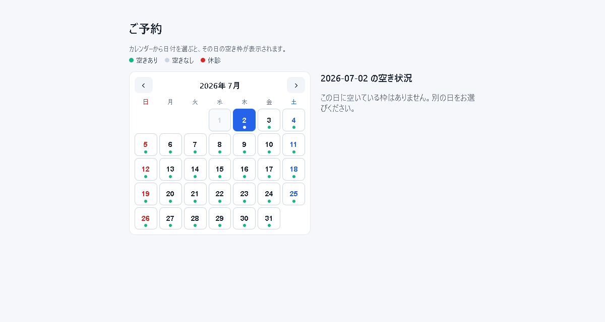

# 🗓️ 整体・クリニック予約システム（clinic-reservation）


> 小規模な整体院・クリニック・サロン向けの、シンプルで実用的な **Web予約システム**。
> 利用者はブラウザから希望日時を選んで予約でき、管理者は管理画面で予約の確認・キャンセルや各種設定を行えます。

## 🌐 ▶ 今すぐ試す（ライブデモ）

### **https://lab.4510.be/clinic-reservation/**

[](https://lab.4510.be/clinic-reservation/)

> 利用者側の予約フロー（日付選択→空き枠→予約→完了）は自由にお試しいただけます。
> **管理画面 `/admin/` はデフォルトでログインできません**（不正アクセス防止のため公開デモでは無効化）。管理画面を試したい方は [https://4510.be/contact/](https://4510.be/contact/) までお問い合わせください。



> ⚠️ デモは公開環境です。**実データ（本物の氏名・電話・メール）は入れないでください**。

---

## ✨ 主な機能

- 📅 **空き枠予約** — 営業時間から自動生成した枠を表示し、希望枠を選んで予約
- 🔒 **二重予約防止** — DBの `UNIQUE(date,time)` 制約で同一日時の重複を自動拒否
- 🧾 **予約完了の控え** — 予約番号付きの完了画面（スクショ控え想定）
- ✉️ **通知メール** — 予約時にお客さま控え＋お店通知を自動送信。送信方法は **「サーバー標準（mail）」/「Gmail（SMTP）」** から選択
- 🛠 **管理画面** — 予約一覧・キャンセル、各種設定、テスト送信
- 🔑 **管理ログイン** — ID（メール）＋パスワード。**パスワード再設定 / ログイン情報リセット**（メールのワンタイムリンク・1時間有効・単回）。初期パスワードのままだと**警告バナー**で設定を促す

---

## 🛠 技術スタック

| 区分 | 採用 |
|---|---|
| 言語 | PHP 8 系（フレームワーク不使用・素のPHP） |
| データベース | SQLite（`pdo_sqlite`） |
| Webサーバー | Apache（開発は公式 `php:8.4-apache`） |
| 開発環境 | Docker / docker compose |
| メール（SMTP） | PHPMailer（MIT・取得スクリプトで導入。リポジトリには含めない） |

---

## 📂 ディレクトリ構成

```
clinic-reservation/
├─ public/                 # 公開フォルダ（Webルート）
│  ├─ index.php            #   トップ：日付選択→空き枠表示
│  ├─ reserve.php          #   予約フォーム＆保存
│  ├─ complete.php         #   予約完了
│  ├─ assets/style.css
│  └─ admin/               # 管理エリア（ログイン必須・共有ナビ）
│     ├─ index.php         #     予約一覧・キャンセル（ダッシュボード）
│     ├─ closures.php      #     特定日の休業/営業・個別の枠ふさぎ（カレンダー）
│     ├─ slots.php         #     予約枠設定（営業時間/枠/定休日/休憩/祝日）
│     ├─ mail.php          #     メール送信設定・テスト・デモモード
│     ├─ account.php       #     管理アカウント（ID/パスワード/再設定先）
│     ├─ reset_request.php #     パスワード/ログインのリセット要求
│     ├─ reset.php         #     リセットのリンク先（新PW設定・初期化）
│     └─ _nav.php          #     共有ナビバー（各ページが include）
├─ src/                    # 公開フォルダの外（ロジック・接続）
│  ├─ core/                #   db.php  functions.php  settings.php  config.php
│  ├─ auth/                #   auth.php  admin_guard.php
│  └─ mail/                #   notify.php  lib/PHPMailer/（※Git管理外。bash scripts/fetch-phpmailer.sh）
├─ data/                   # DB実体・holidays.csv（公開フォルダ外・自動生成）
├─ docker/Dockerfile
├─ docker-compose.yml
└─ scripts/fetch-phpmailer.sh
```

> **セキュリティ設計**: DB(`data/`) と ロジック(`src/`) は公開フォルダの外（またはレンタルサーバーでは `.htaccess` で遮断）に置き、URLから直接読めないようにしています。

---

## 🚀 ローカル開発（Docker）

### 前提
- Docker / Docker Desktop

### 手順
```bash
# 1. 設定ファイルを用意（Dockerの起動設定のみ）
cp .env.example .env

# 2. （Gmail送信を試す場合）PHPMailer を取得
bash scripts/fetch-phpmailer.sh

# 3. 起動
docker compose up -d --build

# 4. アクセス
#    利用者ページ : http://localhost:8501/
#    管理ページ   : http://localhost:8501/admin/
#      初期ログイン: admin@example.com / changeme
```

- `public/` `src/` はマウントされ、**編集が即反映**されます（再ビルド不要）。
- DB（`data/database.sqlite`）は**初回アクセス時に自動生成**。
- PHPバージョンは `.env` の `PHP_VERSION`（8.3 / 8.4 など）を変えて `--build` で切替。

停止: `docker compose down`

---

## ⚙️ 設定

設定は **2か所** に分かれています（役割が違います）。

### 1. 初期管理アカウント — `src/config.php`（ファイル）
```php
define('INITIAL_ADMIN_ID',       'admin@example.com'); // 初期ログインID
define('INITIAL_ADMIN_PASSWORD', 'changeme');          // 初期パスワード（平文・このまま使用）
define('INITIAL_ADMIN_EMAIL',    'owner@example.com');  // リセットリンクの送信先
// define('FORCE_INITIAL_ADMIN', true);                 // 緊急復旧（メール不要）
```

### 2. お店の設定 — 管理画面「設定」（DB保存）
店名 / 通知先メール / メール送信方法（サーバー標準・Gmail）/ 送信元 / Gmail認証 / 管理アカウント。
**ファイルを編集せず、ブラウザから変更**できます。

> `.env` は Docker の起動設定（ポート・PHPバージョン）専用です。

---

## 🔐 ログインとセキュリティ

ログインは **ID（メール）＋パスワード**。パスワードの扱いは「ファイル主導」と「UI主導」の2モードです。

| モード | 状態 | パスワード |
|---|---|---|
| **ファイル主導**（初期） | 管理画面で未変更 | `config.php` の**平文を直接照合**（設定が手軽）。`config.php` を書き換えれば即反映 |
| **UI主導** | 管理画面でパスワード等を変更後 | DBに **bcrypt ハッシュ**で保存。以降ファイルは無視 |

- **パスワード忘れ**: ログイン画面 →「パスワードを忘れた方」→ 登録メールに再設定リンク（1時間・単回）→ 新パスワード設定
- **ログイン情報リセット**: → 登録メールにリンク → 実行で ID/パスワードが `config.php` の初期値に戻る
- **緊急復旧（メール不要）**: `config.php` の `FORCE_INITIAL_ADMIN` を一時有効化→アクセス→初期値に戻る（復旧後は必ず元に戻す）
- ファイル主導の間は管理画面に「初期パスワードのまま」**警告バナー**を表示。パスワード設定で消えます。

リセットトークンは平文を保存せず **SHA-256 ハッシュ**で保管、有効期限1時間・単回使用。

---

## ✉️ メール送信

予約時に「お客さま控え（メール入力時）」と「お店通知（通知先メール設定時）」を送信します。送信方法は管理画面で選択：

| 方法 | 仕組み | 特徴 |
|---|---|---|
| サーバー標準 | PHP `mail()` | 設定不要。ただし迷惑メールに入りやすい |
| Gmail | Gmail の SMTP（PHPMailer） | 届きやすい。Googleの**2段階認証＋アプリパスワード**が必要 |

- 送信内容・結果は `data/mail.log` に記録。送信に失敗しても**予約処理は止まりません**（予約はDB確定済み）。
- PHPMailer は `bash scripts/fetch-phpmailer.sh` で `src/mail/lib/PHPMailer/` に取得します（Gmail送信を使う場合）。

---

## 🗃 データ構造（SQLite）

| テーブル | 用途 |
|---|---|
| `reservations` | 予約（日付・時刻・氏名・電話・メール・受付日時、`UNIQUE(date,time)`） |
| `blocked_slots` | 休診・ブロック枠 |
| `settings` | 店名・通知・送信方法・管理アカウント（key/value） |
| `auth_tokens` | リセット用トークン（ハッシュ・期限・使用済みフラグ） |

すべて初回アクセス時に自動作成されます。

---

## ⚠️ 制限・注意

- 公開デモの管理画面 `/admin/` は**デフォルトでログインできません**（誰でも入れないよう無効化）。実運用では**パスワード設定＋HTTPS**必須。
- ログイン試行回数の制限（総当たり対策）は未実装。
- 確認メールはサーバーの `mail()` 環境に依存（不達時は Gmail 送信や送信元ドメインの調整を）。
- 公開デモの「登録メール（再設定先）」はダミー推奨（連打でのメール送信を避けるため）。

---

## 🤝 コントリビュート

Issue や Pull Request を歓迎します。バグ報告・機能提案はお気軽にどうぞ。
役に立ったら ⭐ Star をいただけると励みになります！

## 📄 ライセンス

本プロジェクトは [MIT License](./LICENSE) のもとで公開されています。**商用・改変・再配布を含め、自由にご利用いただけます。**
（同梱取得する PHPMailer も MIT License）

---

Happy booking! 🗓️✨
