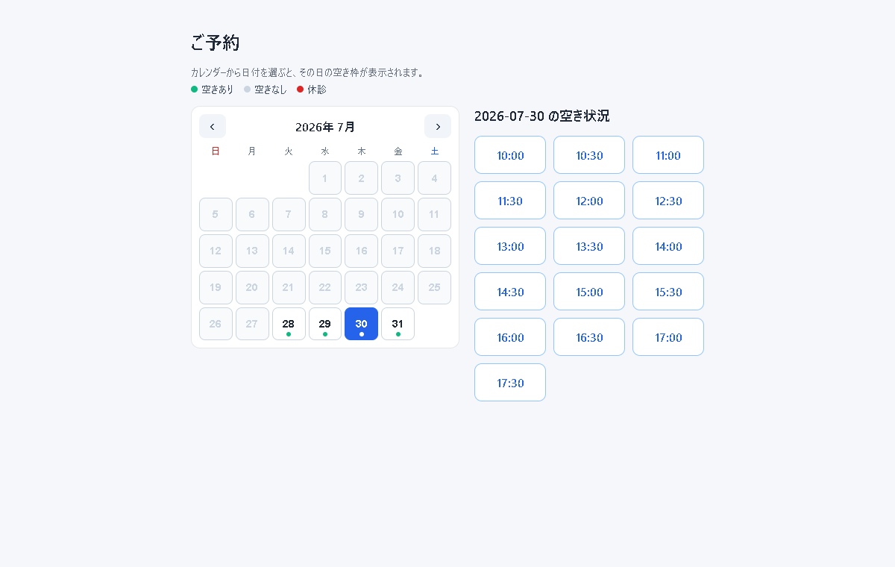

# 🗓️ 整体・クリニック予約システム（clinic-reservation）


> 小規模な整体院・クリニック・サロン向けの、シンプルで実用的な **Web予約システム**。
> 利用者はブラウザから希望日時を選んで予約でき、管理者は管理画面で予約の確認・キャンセルや各種設定を行えます。

## 🌐 ▶ 今すぐ試す（ライブデモ）

### **https://lab.4510.be/clinic-reservation/**

[](https://lab.4510.be/clinic-reservation/)

> 利用者側の予約フロー（日付選択→空き枠→予約→完了）は自由にお試しいただけます。
> **管理画面は公開していません**（不正アクセス防止のため、本番ではアクセス経路を秘匿しています）。管理画面を試したい方は [https://4510.be/contact/](https://4510.be/contact/) までお問い合わせください。



> ⚠️ デモは公開環境です。**実データ（本物の氏名・電話・メール）は入れないでください**。

---

## ✨ 主な機能

- 📅 **公開予約カレンダー** — 月表示のカレンダーで **空きあり / 空きなし / 休診** が一目で分かり、日付を選ぶとその日の空き枠が出ます（空き状況は JSON API `public/api/availability.php` から取得）
- 🗓 **空き枠予約** — 営業時間・枠の長さ・定休日・休憩・祝日の設定から枠を**毎回計算して**生成（枠自体はDBに持たない）
- 🚫 **休業・枠ふさぎ** — 特定日の終日休業／例外営業、開いている日の中の1枠だけふさぐ、を管理カレンダーから操作
- 🔒 **二重予約防止** — 予約確定を `BEGIN IMMEDIATE` で直列化し、その中で残席を数えて定員超過を弾きます（定員2以上に対応するため、旧 `UNIQUE(date,time)` 制約は撤去済み）。**30並列で実測**し、成立1件・超過0件・500エラー0件。あふれた側には理由付きの案内を出します
- 🧾 **予約完了の控え** — 予約番号付きの完了画面（スクショ控え想定）
- ✉️ **通知メール** — 予約時にお客さま控え＋お店通知を自動送信。送信方法は **「サーバー標準（mail）」/「Gmail（SMTP）」** から選択
- ⏰ **来院前リマインダー** — 「予約日の N 日前の H 時」を過ぎたお客さまへ自動で1通。**1予約1通を DB の台帳で保証**し、cron が用意できない環境では**公開ページのアクセス契機**でも送れます（純PHP・外部サービス不要）
- 🛠 **管理画面** — 予約一覧・キャンセル、各種設定、テスト送信
- 📊 **統計** — 月別・曜日別・時間帯別の予約件数とリピート率（`public/admin/stats.php`）。**外部ライブラリもJSも使わず**、SQLite の集約関数と CSS の棒グラフだけで描画するので、レンタルサーバーへ置いてもネットワークに出ずに同じように動きます。実用の中心は**時間帯別**で、予約枠設定を見直す一次資料になります。⚠️ キャンセルは行ごと削除される設計のため**キャンセル率は出せません**（画面にも明記）
- 📖 **使い方ガイド（同梱）** — 管理画面の「使い方」タブに、**お店の方向け**のスクリーンショット付き手順書を同梱（`public/admin/guide.php`）。設置を代行する運用を前提に、オーナーが触る操作だけを平易な言葉でまとめてあります。今の営業時間・定休日など**実際の設定値をその場で読んで表示**するので、文章と画面がズレません
- 🔑 **管理ログイン** — ID（メール）＋パスワード。**パスワード再設定 / ログイン情報リセット**（メールのワンタイムリンク・1時間有効・単回）。初期パスワードのままだと**警告バナー**で設定を促す
- 🛡 **多層防御** — ログイン試行回数の制限、**2段階認証（TOTP・任意）**、デコイページ（後述）。いずれも**純PHP・追加ライブラリ不要**でレンタルサーバーでも動きます

---

## 🛠 技術スタック

| 区分 | 採用 |
|---|---|
| 言語 | PHP 8 系（フレームワーク不使用・素のPHP） |
| データベース | SQLite（`pdo_sqlite`） |
| Webサーバー | Apache（開発は公式 `php:8.4-apache`） |
| 開発環境 | Docker / docker compose |
| メール（SMTP） | PHPMailer（MIT・取得スクリプトで導入。リポジトリには含めない） |

---

## 📂 ディレクトリ構成

```
clinic-reservation/
├─ public/                 # 公開フォルダ（Webルート）
│  ├─ index.php            #   トップ：予約カレンダー→空き枠表示
│  ├─ reserve.php          #   予約フォーム＆保存
│  ├─ complete.php         #   予約完了
│  ├─ api/availability.php #   空き状況API（JSON・カレンダーが呼ぶ）
│  ├─ assets/
│  │  ├─ style.css
│  │  ├─ calendar.js       #   公開/管理で共用するカレンダー描画
│  │  └─ otp-input.js      #   認証コード欄の全角→半角正規化（IME対策）
│  ├─ hp.php ほか          #   デコイ（意図的な罠。後述「デコイページ」）
│  └─ admin/               # 管理エリア（ログイン必須・共有ナビ）
│     ├─ index.php         #     予約一覧・キャンセル（ダッシュボード）
│     ├─ closures.php      #     特定日の休業/営業・個別の枠ふさぎ（カレンダー）
│     ├─ slots.php         #     予約枠設定（営業時間/枠/定休日/休憩/祝日）
│     ├─ mail.php          #     メール送信設定・テスト・デモモード
│     ├─ stats.php         #     統計（月別/曜日別/時間帯別・リピート率）
│     ├─ guide.php         #     使い方ガイド（お店の方向け・実設定値を反映）
│     ├─ account.php       #     管理アカウント（ID/パスワード/再設定先/2段階認証＋QR）
│     ├─ reset_request.php #     パスワード/ログインのリセット要求
│     ├─ reset.php         #     リセットのリンク先（新PW設定・初期化）
│     └─ _nav.php          #     共有ナビバー（各ページが include）
├─ src/                    # 公開フォルダの外（ロジック・接続）
│  ├─ core/
│  │  ├─ config.php        #   初期管理アカウント等（ファイル設定）
│  │  ├─ db.php            #   接続・テーブル自動作成
│  │  ├─ functions.php     #   空き枠の計算ロジック（枠はDBに持たず毎回導出）
│  │  ├─ reservations.php  #   予約モデル（薄いデータ層）
│  │  ├─ closures.php      #   休業・枠ふさぎモデル
│  │  ├─ settings.php      #   設定（DB保存）
│  │  ├─ view.php          #   共有レイアウト（head/foot の partial）
│  │  ├─ qr.php            #   QRコード生成（純PHP・SVG出力。2段階認証の登録用）
│  │  └─ honeypot.php      #   デコイの記録・自動ブロック（DB非依存の単独モジュール）
│  ├─ auth/                #   auth.php  admin_guard.php  rate_limit.php  totp.php
│  └─ mail/                #   notify.php  lib/PHPMailer/（※Git管理外。bash scripts/fetch-phpmailer.sh）
├─ data/                   # DB実体・holidays.csv・ログ（公開フォルダ外・自動生成）
├─ docker/Dockerfile
├─ docker-compose.yml
└─ scripts/fetch-phpmailer.sh
```

> **セキュリティ設計**: DB(`data/`) と ロジック(`src/`) は公開フォルダの外（またはレンタルサーバーでは `.htaccess` で遮断）に置き、URLから直接読めないようにしています。

---

## 🚀 ローカル開発（Docker）

### 前提
- Docker / Docker Desktop

### 手順
```bash
# 1. 設定ファイルを用意（Dockerの起動設定のみ）
cp .env.example .env

# 2. （Gmail送信を試す場合）PHPMailer を取得
bash scripts/fetch-phpmailer.sh

# 3. 起動
docker compose up -d --build

# 4. アクセス
#    利用者ページ : http://localhost:8501/
#    管理ページ   : http://localhost:8501/admin/
#      初期ログイン: admin@example.com / changeme
```

- `public/` `src/` はマウントされ、**編集が即反映**されます（再ビルド不要）。
- DB（`data/database.sqlite`）は**初回アクセス時に自動生成**。
- PHPバージョンは `.env` の `PHP_VERSION`（8.3 / 8.4 など）を変えて `--build` で切替。

停止: `docker compose down`

---

## ⚙️ 設定

設定は **2か所** に分かれています（役割が違います）。

### 1. 初期管理アカウント — `src/core/config.php`（ファイル）
```php
define('INITIAL_ADMIN_ID',       'admin@example.com'); // 初期ログインID
define('INITIAL_ADMIN_PASSWORD', 'changeme');          // 初期パスワード（平文・このまま使用）
define('INITIAL_ADMIN_EMAIL',    'owner@example.com');  // リセットリンクの送信先
// define('FORCE_INITIAL_ADMIN', true);                 // 緊急復旧（メール不要）
```

### 2. お店の設定 — 管理画面「設定」（DB保存）
店名 / 通知先メール / メール送信方法（サーバー標準・Gmail）/ 送信元 / Gmail認証 / 管理アカウント。
**ファイルを編集せず、ブラウザから変更**できます。

### 3. 管理画面を隠す（任意・本番向け）
GitHub Actions でデプロイする場合、リポジトリの Secret **`ADMIN_SLUG`** に推測されにくい値を設定すると、管理画面がその**秘密パス配下へ移り `/admin` は 404** になります（未設定なら `/admin/` のまま）。値は Secret にのみ保持され、公開されません。

> `.env` は Docker の起動設定（ポート・PHPバージョン）専用です。

---

## 🔐 ログインとセキュリティ

ログインは **ID（メール）＋パスワード**。パスワードの扱いは「ファイル主導」と「UI主導」の2モードです。

| モード | 状態 | パスワード |
|---|---|---|
| **ファイル主導**（初期） | 管理画面で未変更 | `config.php` の**平文を直接照合**（設定が手軽）。`config.php` を書き換えれば即反映 |
| **UI主導** | 管理画面でパスワード等を変更後 | DBに **bcrypt ハッシュ**で保存。以降ファイルは無視 |

- **パスワード忘れ**: ログイン画面 →「パスワードを忘れた方」→ 登録メールに再設定リンク（1時間・単回）→ 新パスワード設定
- **ログイン情報リセット**: → 登録メールにリンク → 実行で ID/パスワードが `config.php` の初期値に戻る
- **緊急復旧（メール不要）**: `config.php` の `FORCE_INITIAL_ADMIN` を一時有効化→アクセス→初期値に戻る（復旧後は必ず元に戻す）
- ファイル主導の間は管理画面に「初期パスワードのまま」**警告バナー**を表示。パスワード設定で消えます。

リセットトークンは平文を保存せず **SHA-256 ハッシュ**で保管、有効期限1時間・単回使用。

- **総当たり対策**: ログイン失敗が続くと送信元IPを一時ロック（既定 5回/15分 → 15分）。成功で解除。
- **2段階認証（TOTP・任意）**: 管理画面「アカウント」で有効化すると、ログイン時に認証アプリ（Google Authenticator 等）の6桁コードを要求。**リカバリコード**付き、緊急復旧（`config.php` の `FORCE_INITIAL_ADMIN`）で解除可。純PHP実装で追加ライブラリ不要。
  - **セットアップQRコード**: 有効化時にQRを表示し、スマホのカメラで読み取って登録できます。QRの生成も**純PHPの自作実装**（`src/core/qr.php`・SVG出力）で、Composer も GD 拡張も不要。**秘密鍵を外部のQR生成APIへ渡さずに済む**ことが自前実装の狙いです。読み取れない環境向けに、従来のセットアップキー手入力と `otpauth://` リンクも折りたたみで残しています
  - **認証コードの全角入力に対応**: PCでは日本語IMEが有効なまま6桁を打ってしまい、全角数字のまま送信されて弾かれることがあります。ブラウザ側（`public/assets/otp-input.js`）とサーバー側（`totp_normalize_input()`）の二重で半角へ正規化します。ログイン欄はリカバリコードも入るため英字とハイフンも許容

### 🪤 デコイページ（意図的な「罠」）

`public/` の中に `wp-login.php` / `xmlrpc.php` / `wp-admin/` / `administrator/` / `phpmyadmin/` があります。**これは WordPress の残骸ではなく、意図的に置いたデコイ**です。このアプリは WordPress を一切使っていません。

自動化された攻撃ツールは、まずこうした「定番パス」を総当たりで探します。デコイはそのアクセスを記録し、繰り返す相手を一定時間ブロックします。実装は **DB に依存しない単独モジュール `src/core/honeypot.php`** で、書き込み可能な `data/` さえあれば動くため、レンタルサーバーへそのまま持ち込めます。

不要なら `public/` からデコイのファイル／ディレクトリを削除するだけで無効化できます（本体の動作には影響しません）。

---

## ✉️ メール送信

予約時に「お客さま控え（メール入力時）」と「お店通知（通知先メール設定時）」を送信します。送信方法は管理画面で選択：

| 方法 | 仕組み | 特徴 |
|---|---|---|
| サーバー標準 | PHP `mail()` | 設定不要。ただし迷惑メールに入りやすい |
| Gmail | Gmail の SMTP（PHPMailer） | 届きやすい。Googleの**2段階認証＋アプリパスワード**が必要 |

- 送信内容・結果は `data/mail.log` に記録。送信に失敗しても**予約処理は止まりません**（予約はDB確定済み）。
- PHPMailer は `bash scripts/fetch-phpmailer.sh` で `src/mail/lib/PHPMailer/` に取得します（Gmail送信を使う場合）。

### ⏰ 来院前リマインダー

管理画面「メール」でONにすると、**予約日の N 日前の H 時**を過ぎたお客さまへお知らせを1通送ります（メール入力者のみ）。

**送信基準は「窓」ではなく1点の時刻**です。予約日 D に対し `送信開始 = (D - N日) の H:00` と定め、「それを過ぎていて、まだ予約時刻が来ていない」ものを対象にします。実行が遅れても取りこぼしません（18時に動かせなくても翌朝の実行で送られる）。送信開始時刻より**後**に入った予約は対象外です（確定メールと重なるため）。

**1予約1通の保証**は `reminder_log`（主キー = `reservation_id`）で行います。送信直前に `INSERT OR IGNORE` で行を立て、**1行入った側だけが送信**します。cron と画面アクセス契機が同時に走っても二重送信しません。

実行経路は4つ:

| 経路 | 用途 |
|---|---|
| **Docker 本番イメージの定期実行** | `docker/Dockerfile.oracle` で動かす場合、entrypoint が **www-data として10分ごと**に CLI を回します（`REMINDER_SWEEP_SECONDS` で変更、`0` で無効）。設定不要で、デプロイでも消えません |
| `php bin/send-reminders.php` | レンタルサーバー等では cron / タスクスケジューラから。`--dry` で対象の一覧だけ表示、`--quiet` で送るものが無ければ無言 |
| 公開ページのアクセス契機 | 上のどちらも用意できない環境の保険。10分に1回まで間引き、ページ出力**後**に実行（閲覧者を待たせない）。1回あたり20通が上限 |
| 管理画面「お知らせメールを今すぐ送る」 | 時刻を待たずに送る・動作確認 |

```sh
# cron（毎時。実際に送るかの判定はアプリ側の設定で行うので毎時で構わない）
0 * * * * cd /path/to/clinic-reservation && php bin/send-reminders.php >> data/cron.log 2>&1

# Docker（ローカル開発）— ⚠ Web と同じユーザーで実行する
docker compose exec -T -u www-data web php /var/www/html/bin/send-reminders.php --dry
```

> ⚠️ アクセス契機だけに頼ると、**アクセスが無い時間帯は送信も止まります**。定期実行を用意できるなら cron を使ってください。
>
> 📌 **本番イメージに定期実行を内蔵した理由。** 以前はアクセス契機だけで、実際には死活監視が15分ごとに
> トップページを叩くので動いてはいました。ただしそれは**監視の副作用**で、監視を止めれば通知も止まります。
> 専用コンテナや host cron ではなくイメージの中に閉じたのは、前者はスコープデプロイ（`up -d --build clinic`）で
> 片方だけ古い版のまま残りやすく、後者は git に残らず再構築時に必ず忘れるからです。
> 定期実行は `--quiet` で回すので、**送るものが無い間はログに何も出ません**（10分おきの「対象0件」で
> 本当に見たい失敗行が埋もれないように）。
>
> 🔴 **CLI は Web と同じユーザーで実行すること。** root で回すと、その実行が作ったファイル（`mail.log` / `reminder_last_run` / SQLite の `-journal`）が root 所有になり、以後 Web 側（`www-data`）が書けなくなります。メール記録が無言で消え、間引きが効かなくなり、最悪は予約の書き込み自体が失敗します（検証中に実際に踏みました）。保険として CLI は終了時に `data/` の所有者を DB ファイルに揃えますが、権限が無ければ何もできないので、まずは実行ユーザーを合わせてください。レンタルサーバーの cron は通常その利用者自身で動くため問題になりません。

---

## 🗃 データ構造（SQLite）

| テーブル | 用途 |
|---|---|
| `reservations` | 予約（日付・時刻・氏名・電話・メール・受付日時）。⚠️ 旧 `UNIQUE(date,time)` は撤去済み（定員2以上に対応するため。二重予約防止は `BEGIN IMMEDIATE`＋残席チェック） |
| `blocked_slots` | 開いている日の中の「1枠だけふさぐ」指定 |
| `day_overrides` | 特定日の終日指定（`closed`=休業 / `open`=例外営業） |
| `settings` | 店名・通知・送信方法・管理アカウント・2段階認証（key/value） |
| `auth_tokens` | リセット用トークン（ハッシュ・期限・使用済みフラグ） |
| `login_throttle` | ログイン失敗の記録（総当たり対策の一時ロック） |
| `reminder_log` | リマインダー送信済み台帳（主キー=`reservation_id`。1予約1通の保証） |

すべて初回アクセス時に自動作成されます。列や索引の追加は `src/core/migrate.php` の手順として書きます（`CREATE TABLE IF NOT EXISTS` を直しても既存DBには届かないため）。

---

## ⚠️ 制限・注意

- 公開デモの管理画面は**非公開**（不正アクセス防止のため、本番ではアクセス経路を秘匿）。実運用では**パスワード設定＋HTTPS**必須。
- 確認メールはサーバーの `mail()` 環境に依存（不達時は Gmail 送信や送信元ドメインの調整を）。
- 公開デモの「登録メール（再設定先）」はダミー推奨（連打でのメール送信を避けるため）。

---

## 🤝 コントリビュート

Issue や Pull Request を歓迎します。バグ報告・機能提案はお気軽にどうぞ。
役に立ったら ⭐ Star をいただけると励みになります！

## 📄 ライセンス

本プロジェクトは [MIT License](./LICENSE) のもとで公開されています。**商用・改変・再配布を含め、自由にご利用いただけます。**
（同梱取得する PHPMailer も MIT License）

---

Happy booking! 🗓️✨
